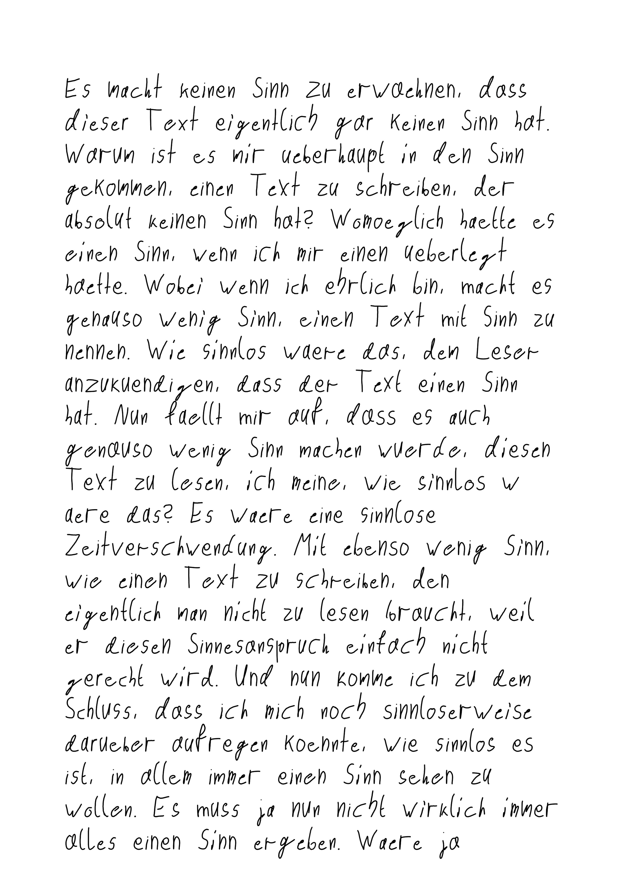
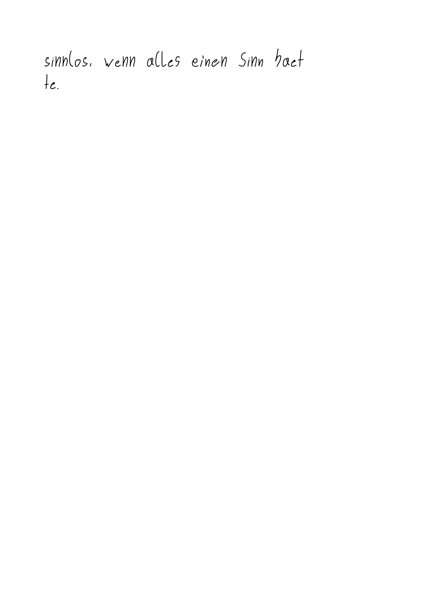

# text-to-handwriting

A program that converts text to handwriting and outputs it as an image

```
Es macht keinen Sinn zu erwaehnen, dass dieser Text eigentlich gar keinen Sinn hat. Warum ist es mir ueberhaupt in den Sinn gekommen, einen Text zu schreiben, der absolut keinen Sinn hat? Womoeglich haette es einen Sinn, wenn ich mir einen ueberlegt haette. Wobei wenn ich ehrlich bin, macht es genauso wenig Sinn, einen Text mit Sinn zu nennen. Wie sinnlos waere das, dem Leser anzukuendigen, dass der Text einen Sinn hat. Nun faellt mir auf, dass es auch genauso wenig Sinn machen wuerde, diesen Text zu lesen, ich meine, wie sinnlos waere das? Es waere eine sinnlose Zeitverschwendung. Mit ebenso wenig Sinn, wie einen Text zu schreiben, den eigentlich man nicht zu lesen braucht, weil er diesen Sinnesanspruch einfach nicht gerecht wird. Und nun komme ich zu dem Schluss, dass ich mich noch sinnloserweise darueber aufregen koennte, wie sinnlos es ist, in allem immer einen Sinn sehen zu wollen. Es muss ja nun nicht wirklich immer alles einen Sinn ergeben. Waere ja sinnlos, wenn alles einen Sinn haette.
```

will be converted to:



